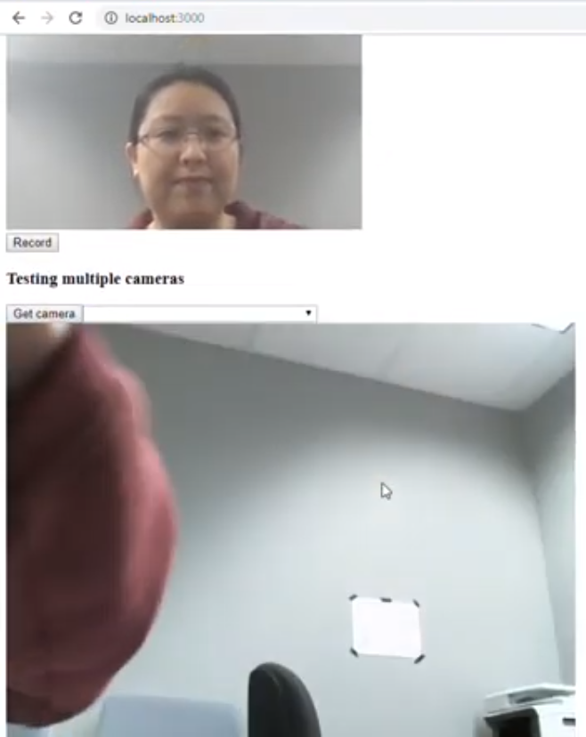

# Webcam based on Node JS

Video (click to view): 

Refer to 

1. Web media API demo
https://github.com/BuildingXwithJS/webmedia-demo

2.Choosing cameras in Javascript: 
https://www.twilio.com/blog/2018/04/choosing-cameras-javascript-mediadevices-api.html